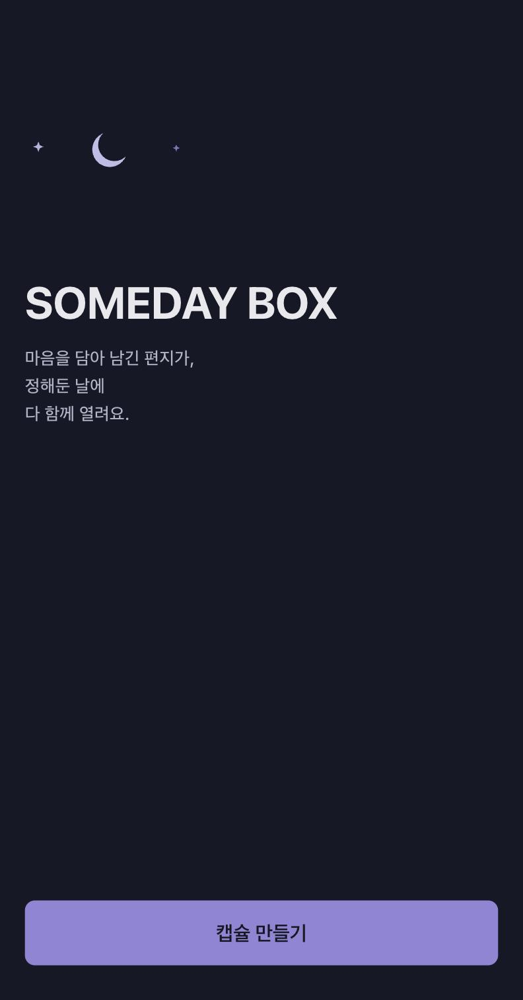
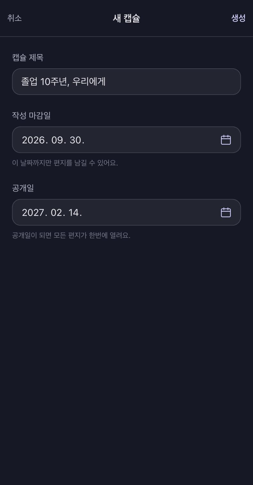
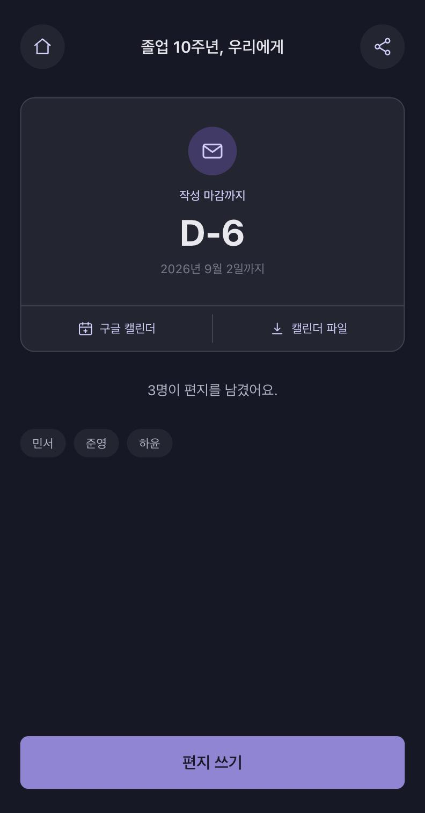
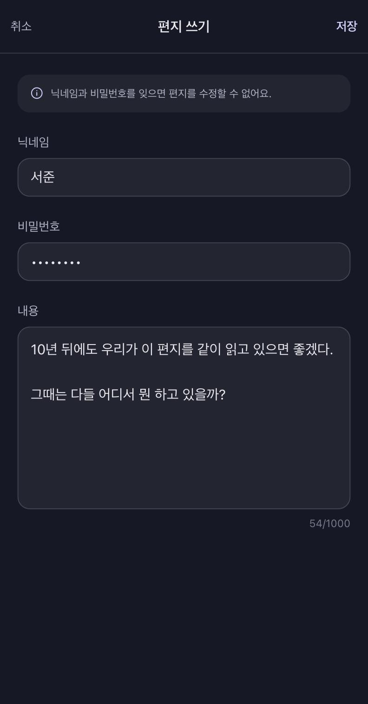
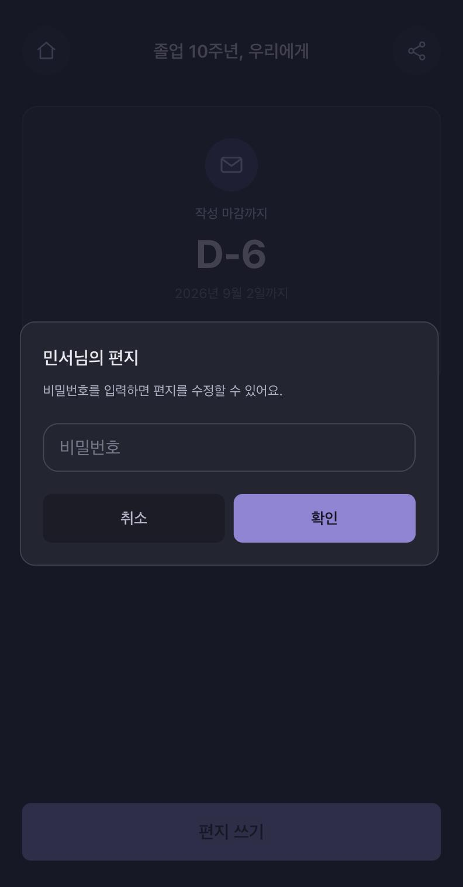
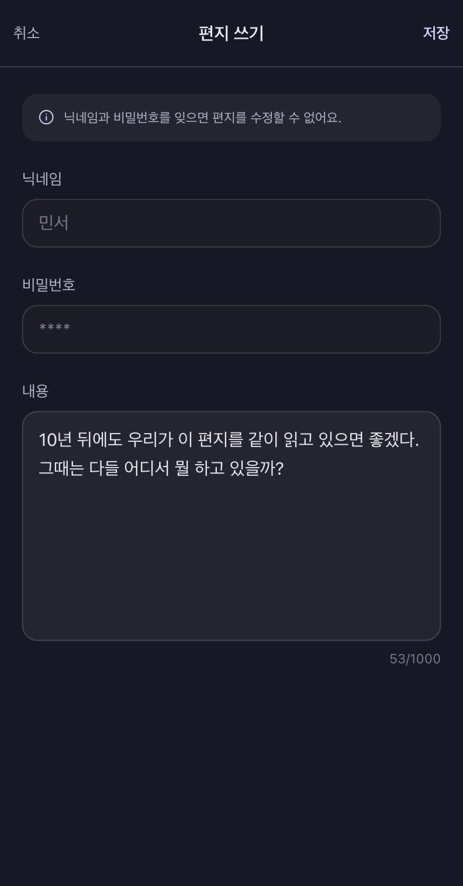
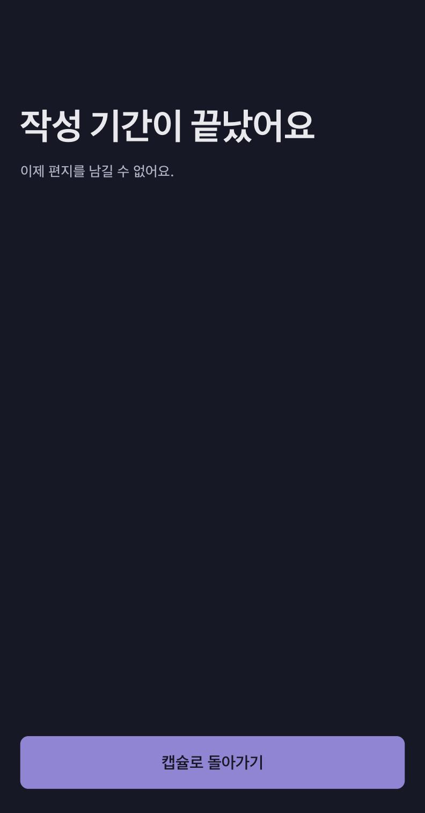
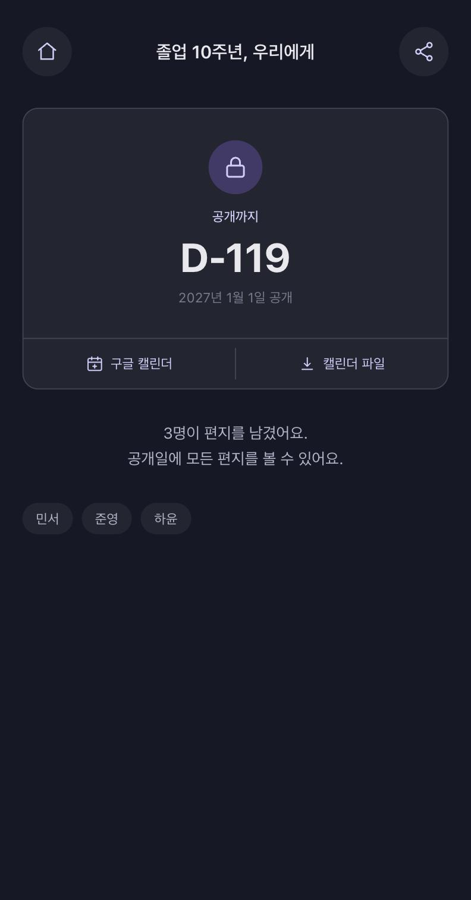
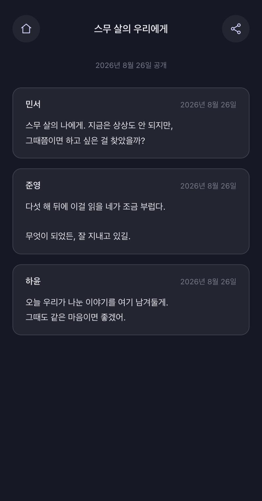

# Someday Box

링크를 공유해 여러 명이 편지를 남기고, 정해둔 날이 되면 다 함께 열리는 타임 캡슐.

🔗 **[someday-box.vercel.app](https://someday-box.vercel.app)**

`Next.js 16` · `React 19` · `React Hook Form` · `Zod` · `TypeScript` · `Supabase(Postgres + RLS)` · `TanStack Query` · `Zustand` · `Tailwind v4` · `Vitest`

## 화면

- 주 유입 경로가 카카오톡 링크 공유라 모바일 전용으로 만들었다.
- 캡슐을 생성하여, 작성 기간에 편지를 모으고, 마감 후에는 잠기고, 공개일에 열린다.
- 로그인이 없다. 링크가 곧 초대장이고, 편지의 소유권은 닉네임과 비밀번호로만 증명한다.

| 메인                                                            | 캡슐 생성                                                                      | 작성 기간                                                                         |
| --------------------------------------------------------------- | ------------------------------------------------------------------------------ | --------------------------------------------------------------------------------- |
|  |  |  |

| 편지 쓰기                                                                    | 비밀번호 확인                                                                            | 편지 수정                                                                   |
| ---------------------------------------------------------------------------- | ---------------------------------------------------------------------------------------- | --------------------------------------------------------------------------- |
|  |  |  |

| 작성 기간 종료 후, 편지 작성 화면 접근                                                      | 잠김                                                                   | 공개                                                                     |
| ------------------------------------------------------------------------------------------- | ---------------------------------------------------------------------- | ------------------------------------------------------------------------ |
|  |  |  |

## 주요 기능

- 캡슐 생성 — 제목, 작성 마감일, 공개일을 정하면 공유용 링크가 나온다
- 편지 작성 — 링크를 받은 사람이 닉네임·비밀번호와 함께 편지를 남긴다
- 편지 수정 — 참여자 목록에서 자기 닉네임을 눌러 비밀번호로 열고 고친다
- 캡슐 공개 — 공개일이 지나면 모두의 편지가 작성순으로 공개된다
- 공개일 알림 — `.ics` 파일 또는 구글 캘린더 링크로 각자 캘린더에 담는다

## 구조

```
src/
  app/          Next.js App Router. 페이지와 Route Handler
  domain/       순수 함수. 프레임워크·브라우저 API import 금지 (ESLint로 강제)
  features/
    capsule/    api · model · ui
    letter/     api · model · ui
  shared/       time · toast · ui
  lib/          Supabase 클라이언트, 컬럼 상수, 에러 매핑
supabase/
  migrations/   스키마 · RLS 정책 · RPC 함수 (7개)
docs/
  decisions.md  설계 결정 9건
```

## 로컬 실행

```bash
npm install
cp .env.example .env.local   # Supabase URL / anon key 채우기
npm run dev
```

| 명령어              | 설명          |
| ------------------- | ------------- |
| `npm run dev`       | 개발 서버     |
| `npm run build`     | 프로덕션 빌드 |
| `npm run typecheck` | 타입 검사     |
| `npm run lint`      | ESLint        |
| `npm test`          | Vitest 실행   |

작업 완료 전 `npm run typecheck && npm run lint && npm test` 를 모두 통과해야 한다.

## 문서

- [docs/decisions.md](./docs/decisions.md) — 설계 결정 9건과 그렇게 정한 이유
- [CLAUDE.md](./CLAUDE.md) — 작업 규칙과 컨벤션

## 블로그

✏️ **[Supabase RLS로 시간 잠금 구현하기](https://velog.io/@sdong/Supabase-RLS로-시간-잠금-구현하기)** <br />
✏️ **[UI 테스트를 위한, 시간 의존 로직 설계](https://velog.io/@sdong/UI-테스트를-위한-시간-의존-로직-설계)** <br />
✏️ **[Next.js App Router에서 서버·클라이언트 경계를 나눈 기준](https://velog.io/@sdong/Next.js-App-Router에서-서버클라이언트-경계를-나눈-기준)**
